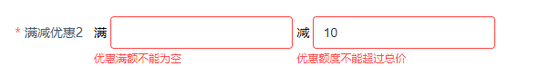

# 表单校验
> 表单组件值的格式校验

分为以下几种情况：

1. 内置组件/自定义组件，只关联一个字段
2. 内置组件，关联多个字段
3. 自定义组件，关联多个字段

## 1. 内置组件/自定义组件，只关联一个字段

内置组件，大部分只关联1个字段.

#### 示例1

```javascript
{
  key: 'input_number_age',
  title: '年龄',
  type: 'input-number',
  props: {},
  append(h, item) {
    return h('span', null, '岁')
  },
  rule: [{
    type: 'number',
    required: true,
    message: '请填写年龄',
    trigger: 'blur'
  }]
}
```
rule格式要求：
1. 多个规则，类型为Array
2. 单个规则，类型可为Object

同官方[element-ui Form表单](https://element.eleme.cn/1.4/#/zh-CN/component/form)一致。

## 2. 内置组件，关联多个字段

组件关联多个字段，如果有校验规则，也需要和字段一一对应。

#### 示例2
```javascript
{
  title: '有效时间',
  type: 'datetime-group',
  required: true,
  keys: ['effectBeginTime', 'effectEndTime'],
  props: {
    dateType: 'datetime',
    // ids: ['effectBeginTime', 'effectEndTime'], // 2.2+已废弃，item.keys替代
    isUserClearMinute: true,
    isSetStartTime: true
  },
  rule: {
    effectBeginTime: {
      required: true,
      type: 'number',
      message: '请选择开始时间',
      trigger: 'change'
    },
    effectEndTime: {
      required: true,
      type: 'number',
      message: '请选择结束时间',
      trigger: 'change'
    }
  }
},
// 或者 （多个字段的校验规则一致可以直接传入数组）
{
  title: '有效时间',
  type: 'datetime-group',
  required: true,
  props: {
    dateType: 'datetime',
    ids: ['effectBeginTime', 'effectEndTime'],
    isUserClearMinute: true,
    isSetStartTime: true
  },
  rule: [{
    required: true,
    type: 'number',
    message: '请选择时间',
    trigger: 'change'
  }]
}
```
rule格式要求：
1. 如果字段不共享校验规则，则，需要用key->value对的形式一一对应。
2. 如果所有字段的校验规则是一样的，则无需遵循上一条为每个字段重复定义一样的规则，直接传入数组。

注意：form-build通过rule的格式来判断是否共享校验规则。如果为Object，则表示不共享，如果为数组则共享。举例如下：

```javascript
{
  title: '有效时间',
  type: 'datetime-group',
  required: true,
  props: {
    dateType: 'datetime',
    ids: ['effectBeginTime', 'effectEndTime'],
    isUserClearMinute: true,
    isSetStartTime: true
  },
  rule: {
    required: true,
    type: 'number',
    message: '请选择时间',
    trigger: 'change'
  }
}
```
rule是Object情况下，组件内部认为字段之间不共享校验规则。会在rule中寻找属性'effectBeginTime'和'effectEndTime'的值分别作为这两个字段的校验规则。


## 3. 自定义组件，关联多个字段

自定义组件通过renderContent或者renderOptions定义内容。不管是哪一种方式，只需要保证将rule通过props传入子组件即可。

具体校验方式请看以下示例。预览效果如下：


先来看下面这个自定义组件：
```html
// 组件 multiple
<template>
  <div class="muptiple">
    <el-form-item prop="pay" :rules="rule.pay || []">
      <span>满</span>
      <el-input type="number" v-model="curPay" @change="payChange"></el-input>
    </el-form-item>
    <el-form-item prop="discount" :rules="rule.discount || []">
      <span>减</span>
      <el-input type="number" v-model="curDiscount" @change="discountChange"></el-input>
    </el-form-item>
  </div>
</template>
<script>
/**
 * 控制多字段的自定义组件
 */
export default {
  data() {
    return {
      curPay: null,
      curDiscount: null
    }
  },
  props: {
    pay: {
      type: [Number, String],
      default: 100
    },
    discount: {
      type: [Number, String],
      default: 0
    },
    rule: {
      type: Object,
      default: () => {}
    }
  },
  watch: {
    pay: {
      immediate: true,
      handler(val, newVal) {
        this.curPay = val
      }
    },
    discount: {
      immediate: true,
      handler(val, newVal) {
        this.curDiscount = val
      }
    }
  },
  methods: {
    payChange(val) {
      this.$emit('payChange', val)
    },
    discountChange(val) {
      this.$emit('discountChange', val)
    }
  }
}
</script>
<style>
.muptiple .el-input {
  width: 200px;
}

.muptiple .el-form-item {
  display: inline-block;
}
</style>
```
该组件关联'pay'，'discount'这2个字段。以下是使用该组件的表单配置部分：

```javascript
// 不使用emitters / listeners
{
  keys: ['pay', 'discount'],
  title: '满减优惠',
  required: true,
  renderContent (h, item, model) {
    return h(multiple, {
      props: {
        pay: model.pay,
        discount: model.discount,
        rule: {
          pay: [{
            required: true,
            transform(value) {
              return String(value)
            },
            message: '优惠满额不能为空',
            trigger: 'blur'
          }],
          discount: [{
            required: true,
            transform(value) {
              return String(value)
            },
            message: '优惠额不能为空',
            trigger: 'blur'
          }, {
            validator (rule,value,callback) {
              console.log('value, model.pay', value, model.pay)
              if (value >= model.pay) {
                callback(new Error('优惠额度不能超过总价'))
              } else {
                callback()
              }
            },
            trigger: 'blur'
          }]
        }
      },
      on: {
        payChange(value) {
          model.pay = value
        },
        discountChange(value) {
          model.discount = value
        }
      }
    })
  }
}
// 使用emitters | listeners
{
  title: '满减优惠',
  required: true,
  renderOptions (h, item, model) {
    return {
      tag: multiple,
      data: {
         props: {
          pay: model.pay,
          discount: model.discount,
          rule: {
            // pay: [...],
            // discount: [...]
          }
        }
      }
    }
  }
}
```

## 关于必填样式

组件关联多个字段时，label必填样式需要设置item.required的配置为true。[具体示例](#示例2)。
